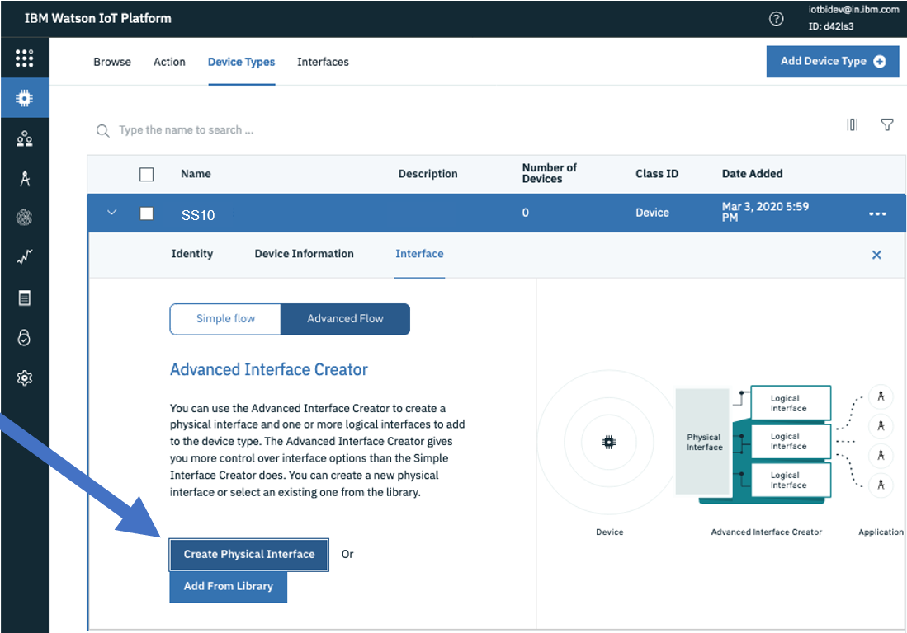
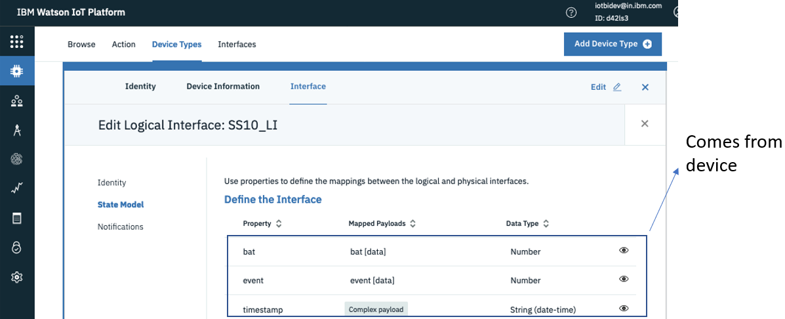

# Add support for Desk Sensors to IBM Tririga Building Insights

In this code pattern, we will see a methodology to add support for desk sensors to `IBM TRIRIGA® Building Insights (TBI)`. 

TBI relies on IoT and AI to connect and securely store data. It uses this data to learn, analyze and visualize a building’s behavior. It is a cloud-based offering that connects building systems, sensors and external products through a responsive web application. With a single click, you can get AI-based insights, such as future occupancy predictions, across your entire enterprise.

Currently, sensors of any type are not supported out of the box by `TBI`. We will demonstrate a methodology to specifically add desk sensor support to `TBI`. This methodology can be extended to support other types of sensors that are currently not supported out-of-the-box in `TBI`.

When the reader has completed this Code Pattern, they will understand how to:
- Add support for a sensor type to `TBI`
- Visualize occupancy insights on `TBI` based on the data from the sensor
    


## Flow


1. Desk sensors send data to Watson IoT Platform
2. The data is transformed and aggregated before being sent to TBI
3. TBI generates occupancy insights

### Functional Components required for Sensor Support ###


### Steps for supporting sensors ###


## Pre-requisites ##

* [**TRIRIGA**](https://www.ibm.com/us-en/marketplace/ibm-tririga)
* [**TRIRIGA Building Insights**](https://www.ibm.com/us-en/marketplace/iot-building-insights)
> Note: TRIRIGA and Building Insights will need to be obtained via the IBM Marketplace, not the IBM Cloud Platform. The link to each service on IBM Marketplace can be found below

## Steps ##

Create the following services:
* [**TRIRIGA**](https://www.ibm.com/us-en/marketplace/ibm-tririga)
* [**TRIRIGA Building Insights**](https://www.ibm.com/us-en/marketplace/iot-building-insights)

### Steps for TRIRIGA System Administrator
#### 3. IOT Platform
- 3.1 [Create device type](#31--32-define-sensor-devices-in-wiotp)
- 3.2 [Create devices, add metadata, connect devices](#31--32-define-sensor-devices-in-wiotp)
- 3.3 [Create physical and logical interface for the device typeW](#33-create-physical--logical-interfaces-for-sensor-devices-in-wiotp)
- 3.4 [Verify raw sensor data in PostgreSQL](#34-verify-raw-sensor-data-in-postgresql)
#### 4. IoT Sensor support component
- 4.1 [Deploy sensor support component(Node-RED) in Cloud](https://github.ibm.com/IoT4Buildings/Desk-Sensor-Support/blob/master/docs/Install_Nodes.md)
- 4.2 [Download and import flow from git](https://github.ibm.com/IoT4Buildings/Desk-Sensor-Support/blob/master/docs/Install_Nodes.md#import-flows)
- 4.3 [Configure flows with required credentials](https://github.ibm.com/IoT4Buildings/Desk-Sensor-Support/blob/master/docs/configure_nodes.md)
- 4.4 [Validate the metadata](https://github.ibm.com/IoT4Buildings/Desk-Sensor-Support/blob/master/docs/validation-flow.md)
- 4.5 [Trigger realtime data aggreation flow](https://github.ibm.com/IoT4Buildings/Desk-Sensor-Support/blob/master/docs/realtime-aggregation-flow.md)
- 4.6 [Trigger historical data aggregation flow](https://github.ibm.com/IoT4Buildings/Desk-Sensor-Support/blob/master/docs/historical-flow.md)

***
#### Sensor schema ####

The reference implementation supports a desk level sensor with the following schema,

```
{
    "timestamp": "12-02-2020 12:52:44",
    "bat": 5,
    "event": 0
}

where,

bat represents the battery level of the sensor
event represents:
0 = Keep Alive
1 = Vacant
2 = Busy
3 = First Transmission
```

#### TBI schema
TBI expects the occupancy information for an organization and not individual desk. The details of data schema is as follows,

```
{
    "time": "12-02-2020T12:52:44.000Z",
    "occupancycount": 50,
    "orgoccupancycount": 30,
    "orgid": "145786",
    "deviceid": "854609"
}
```

where,

| Property          | Type              | Created out of the Box | Comments|
|-------------------|-------------------|------------------------|---------|
| time              | string(date-time) | No                     |  Time at which the occupancy is derived.   Time must be in UTC and in ISO8601 format yyyy-dd-mm'T'hh:mm:ss.sssZ.|
| occupancycount    | number            | No                     |  The derived occupancy count for the given floor   at the specified time.|
| orgoccupancycount | number            | No                     |  The derived occupancy count of an organization(BU) for a specific floor.|
| orgid             | string            | No                     |  The system record id of the organization in TRIRIGA for which the occupancy is calculated.|
| deviceid          | string            | Yes                    |  The system record id of the floor in TRIRIGA for which the occupancy is calculated. This is the deviceid against which the event needs be sent so that it gets added in the appropriate table. |

***


### 3.1 & 3.2 Define sensor devices in WIoTP
In order to connect sensor devices to Watson IoT Platform(WIoTP), first it needs to be registered in WIoTP. [This tutorial](https://cloud.ibm.com/docs/services/IoT?topic=iot-platform-getting-started#step1) provides details about how one can register the device type and devices in WIoTP.
While registering each of the desk level sensor to Watson IoT Platform, the following information needs to be provided as metadata for each of the sensors

* **tririgaFloorId:** This id is the system record id of the floor in TRIRIGA under which the desklevel sensors are deployed
* **tririgaOrgId:** This id is thesystem record id of chargeback organization in TRIRIGA to which the seat is allocated

Following are the steps to add the same in metadata of the devices,
* Click **Edit Metadata** button while registering the deive

* Add **tririgaFloorId** and **tririgaOrgId** obtained from TRIRIGA as shown below


***

### 3.3 Create physical & logical interfaces for sensor devices in WIoTP
The reference implementation of sensor support component expects the sensor data in PostgreSQL and in the following format. 
```
event - Number 
timestamp - data-time in ISO-8601 format
tririgaorgid - String
tririgafloorid - String
```

Example,
```
event - 1 
timestamp - "2020-02-27T17:27:21.000"
tririgaorgid - "546876"
tririgafloorid - "925410"
```
to persist the sensor data in PostgreSQL, physical & logical interface needs to be created in WIoTP. Following are the steps to create the same,

* Make sure that the sensor devices are sending the data so that the creation of interfaces are easy
* Click **Create Physical Interface** from device type page,

* Derive properties from running devices as shown below, (**Note** that the schema may be different based on the sensor)

* Click **Create Logical Interface** as shown below,

* Map the sensor data properties as shown below,

* Add the metadata properties as shown below,

* Also, if required transform the timestamp to ISO-8601 format if the original timestamp is not in ISO-8601 format, For example, use the following transformation logic,
```
$join([ $substring($event.timestamp, 6, 4), '-', $substring($event.timestamp, 3, 2), '-', $substring($event.timestamp, 0, 2), 'T', $substring($event.timestamp, 11, 2), ":", $substring($event.timestamp, 14, 2), ":", $substring($event.timestamp, 17, 2), "+03:00"])
```
* Click activate to activate the interface. WIoTP will create a table with name iot_deviceType (Example, iot_SS10) in PostgreSQL and move the raw sensor data.

***

### 3.4 Verify raw sensor data in PostgreSQL
* Connect to PostgreSQL and verify that table with name "iot_deviceType" exists
* Verify that it receives the latest data in the schema set by logical interface. For example,


***
