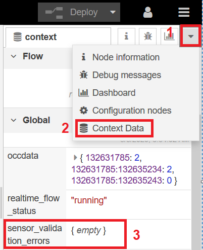
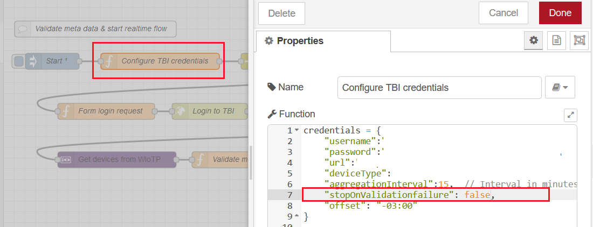

## 4.4 Validation flow

Validation flow verifies whether all the sensor devices are configured with the required meta data and are present in TBI as well, 


Once validation is successful, it automatically triggers the realtime flow and it works in the following way,
* Validates if all the credentials are configured
* Logs into TBI using the provided credentials
* Retrieves all the floors and orgIds that are synched from TRIRIGA to TBI
* Retrieves the meta data of all the sensor devices from WIoTP
* Validates the following,
    * Whether all the devices contain tririgafloorid and tririgaorgid in the metadata
    * Whether the tririgafloorid in the metadata matches the floorid in TBI
```
sensors = msg.payload.results
error_sensors = {}
msg.payload.success = true
tbiFloors = msg.floors
for(i=0;i<sensors.length;i++){
    tririgaFloor = ""
    tririgaOrg = ""
    tririgaFloor = sensors[i].metadata.tririgaFloorId
    tririgaOrg = sensors[i].metadata.tririgaOrgId
    if(tririgaFloor === "" || tririgaOrg === ""){
        error_sensors[sensors[i]['deviceId']] = "Floor Id or Org Id not there in metadata"
    }
    if(!(tbiFloors.includes(tririgaFloor))){
        error_sensors[sensors[i]['deviceId']] = "Floor Id not in TBI floors"
    }
}
```
* If all validation is successful, triggers the realtime aggregation flow
* Validation errors are seen in the debug window or the content window. To view the validation errors in conext window, follow the steps shown in below diagram,



**Note:** Incase if one wants to execute realtime aggregation flow even with the validation failures, then set **stopOnValidationFailure** flag to false in **Configure TBI Credentials** node as shown below,


